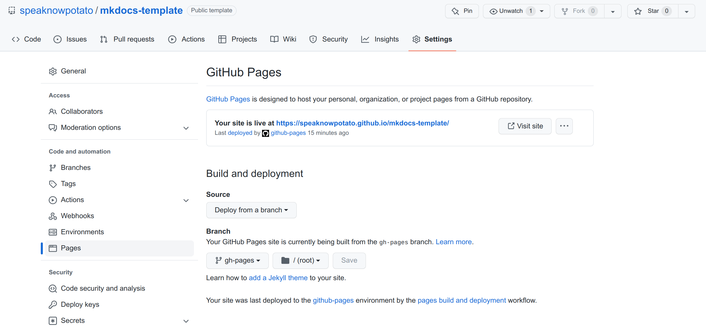

# Quick Start

This tutorial will guide you to build your own mkdocs based documentation website using your own custom domain or github page domain(Example link: https://speaknowpotato.github.io/mkdocs-template/) step by step.

- [Quick Start](#quick-start)
  - [Step 1: Use this template](#step-1-use-this-template)
  - [Step 2: Run mkdocs gh-deploy](#step-2-run-mkdocs-gh-deploy)
  - [Step 3: Setup GitHub Pages](#step-3-setup-github-pages)
  - [Step 4: Visit your site in Github domain](#step-4-visit-your-site-in-github-domain)
  - [[Optional] Step 5: Setup Custom Domain](#optional-step-5-setup-custom-domain)
    - [1.Mkdocs Setting](#1mkdocs-setting)
    - [2. GitHub Pages Setting](#2-github-pages-setting)
    - [3. DNS Setting (Google Domain)](#3-dns-setting-google-domain)
    - [4. Verify domain (Optional)](#4-verify-domain-optional)


## Step 1: Use this template
Go to [https://github.com/speaknowpotato/mkdocs-template](https://github.com/speaknowpotato/mkdocs-template) and click Use this template button.


Clone the repo to your local desktop
```bash
git clone git@speaknow.github.com:speaknowpotato/[YOUR-REPO-NAME].git

```

## Step 2: Run mkdocs gh-deploy

```bash
cd [YOUR-REPO-NAME]
mkdocs gh-deploy
```

## Step 3: Setup GitHub Pages
Go to your Github repo, and click Settings. 
Then click Pages.



Set `Source` to `Deploy from a branch`, and `Branch` to `gh-pages/root`.

## Step 4: Visit your site in Github domain

Click Visit site.


## [Optional] Step 5: Setup Custom Domain

### 1.Mkdocs Setting
Put your custom domain in `docs/CNAME` (see [CNAME](https://github.com/speaknowpotato/mkdocs-template/blob/main/docs/CNAME) as an example). 


Reference: [deploying your docs](https://www.mkdocs.org/user-guide/deploying-your-docs/)


### 2. GitHub Pages Setting
Add your custom domain here and click Save. 


Reference: [Manging a custom domain for your GitHub Pages site](https://docs.github.com/en/pages/configuring-a-custom-domain-for-your-github-pages-site/managing-a-custom-domain-for-your-github-pages-site#configuring-an-apex-domain-and-the-www-subdomain-variant)

### 3. DNS Setting (Google Domain)
This is an example using [Google Domain](https://domains.google.com/), but you can use other domain services as well.

Click DNS under your domain page, add two records under Custom records.


The first one `zhibeima.com` is an apex domain, while the second one `www.zhibeima.com` is a www subdomain.

Reference: [Managing a custom domain for your GitHub Pages site](https://docs.github.com/en/pages/configuring-a-custom-domain-for-your-github-pages-site/managing-a-custom-domain-for-your-github-pages-site)


### 4. Verify domain (Optional)
This step is optional.

>Verifying your domain stops other GitHub users from taking over your custom domain and using it to publish their own GitHub Pages site. 

Click Settings under your GitHub profile, and then click Pages.

Click Add a domain and follow the steps.


Go to Google domain and create a TXT record in your DNS configuration.


Reference: [Verifying your custom domain for GitHub Pages](https://docs.github.com/en/pages/configuring-a-custom-domain-for-your-github-pages-site/verifying-your-custom-domain-for-github-pages)


