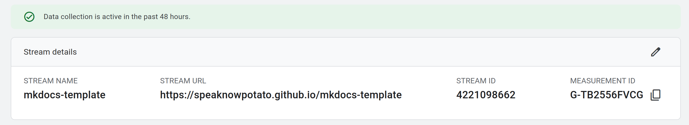

# Setting up site analytics

https://analytics.google.com/




Get the __MEASUREMENT ID__ from Google Analyhtics, and put it in `mkdocs.yml`, 

```code
  analytics:
    provider: google
    property: G-TB2556FVCG
```

It will take some time to be active. (I waited 24 hours)

## Reference
[Setting up site analytics](https://squidfunk.github.io/mkdocs-material/setup/setting-up-site-analytics/#was-this-page-helpful)