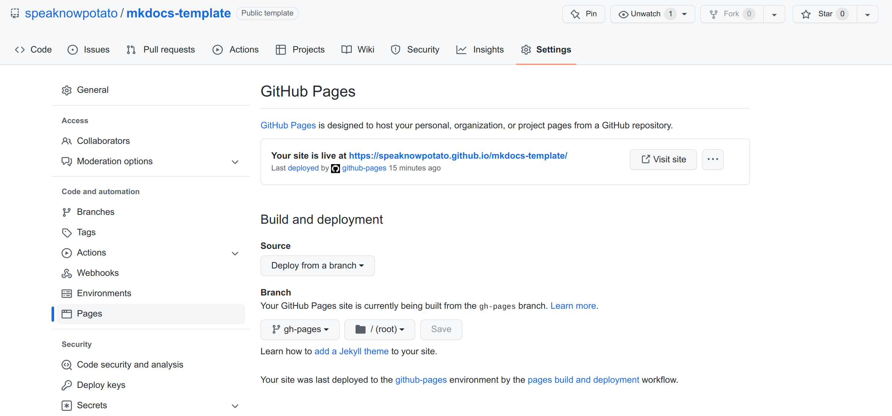
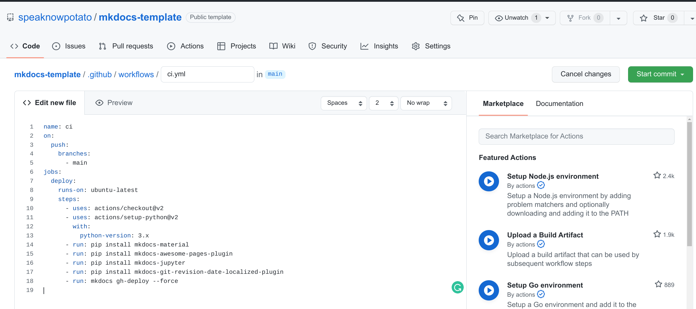

# mkdocs-template

Mkdocs Template using github pages and actions

## How to build mkdocs template

1. init repo
2. set up mkdocs work directories, including `mkdocs.yml` and `docs` directory.
3. set up github pages


Source: Deploy from a branch
Branch: gh-pages/root

4. set up github actions

```yaml
name: ci 
on:
  push:
    branches:
      - main
jobs:
  deploy:
    runs-on: ubuntu-latest
    steps:
      - uses: actions/checkout@v2
      - uses: actions/setup-python@v2
        with:
          python-version: 3.x
      - run: pip install mkdocs-material
      - run: pip install mkdocs-awesome-pages-plugin
      - run: pip install mkdocs-jupyter
      - run: pip install mkdocs-git-revision-date-localized-plugin
      - run: mkdocs gh-deploy --force
```
5. view the [https://speaknowpotato.github.io/mkdocs-template/](https://speaknowpotato.github.io/mkdocs-template/). It's all set.


## Reference
[Managing a custom domain for your GitHub Pages site](https://docs.github.com/en/pages/configuring-a-custom-domain-for-your-github-pages-site/managing-a-custom-domain-for-your-github-pages-site#configuring-an-apex-domain-and-the-www-subdomain-variant)